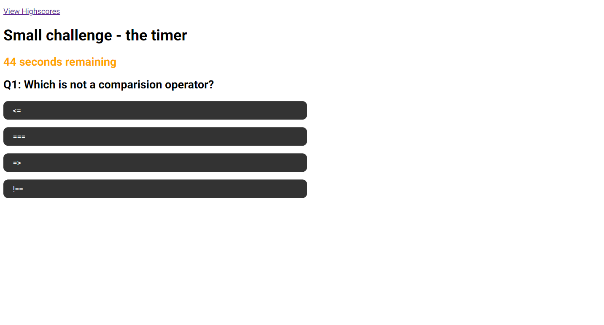

# Code-Quiz-01

## Description

This application is a fun little quiz that allows you to test your coding knowledge. 

Then you enter the application you are presented with a button to start the game. Questions appear one after another with a small message letting you know if you got the previous question correct or wrong. 

Each question you get right will give you 10 points. Each question you get wrong will take away 10 seconds from the clock!

If you are reading this, the application is only 90% complete. Future improvements need to address logging multiple users in the highscore page, the overall styling and finally the quizzes length. 

## Usage

Why not try it out yourself. Here is the link to the final product: [Coding Quiz](https://andrew60199.github.io/Code-Quiz-01/)

Above is a screenshot of the first question of the quiz. 

## Licences

Refer to the 'LICENSE' file 